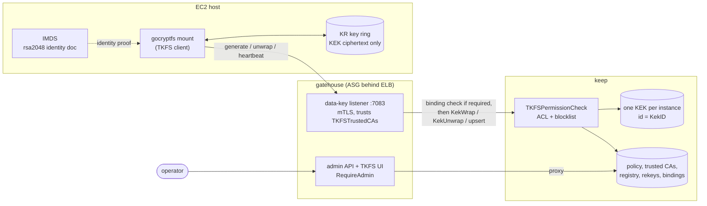
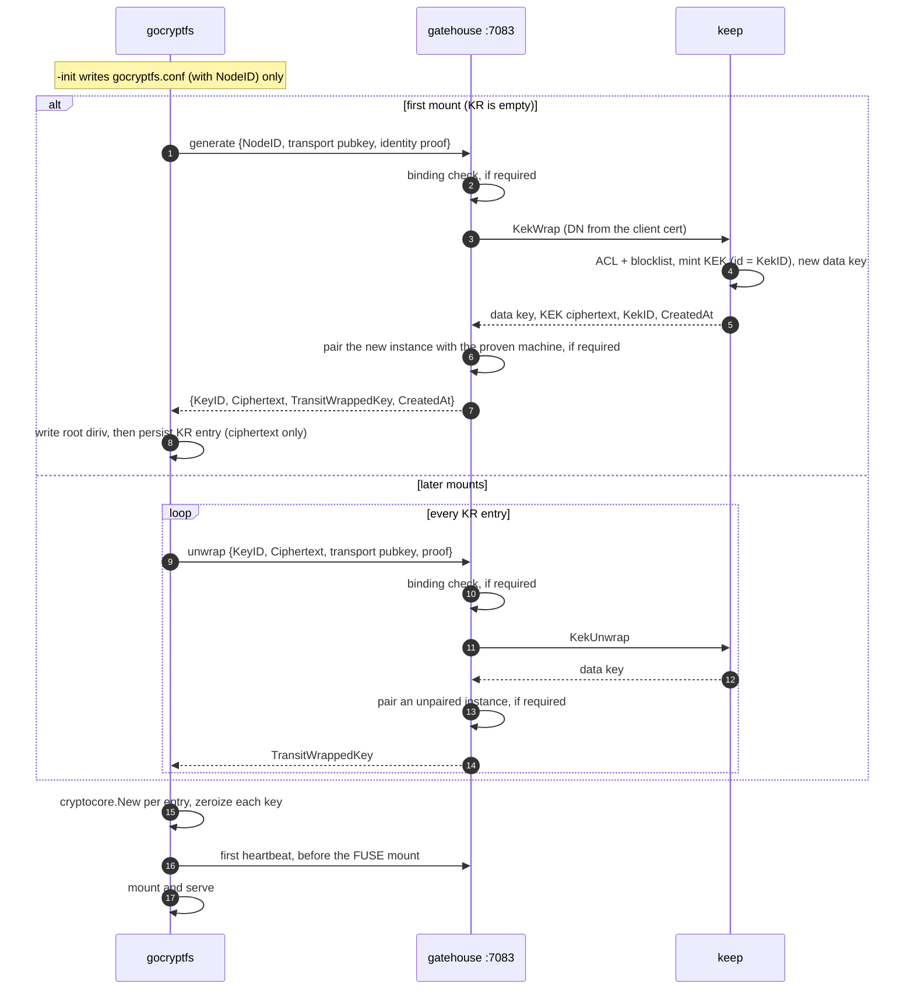
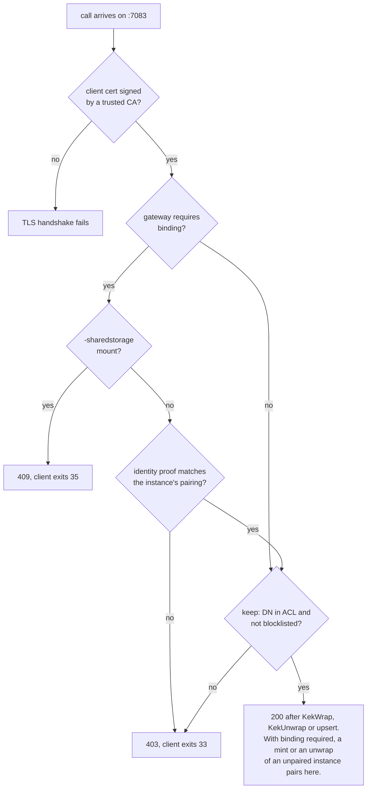
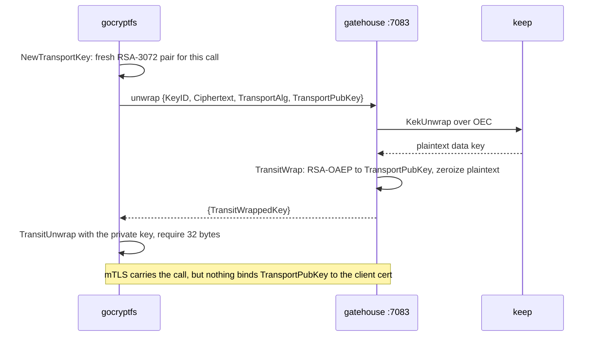
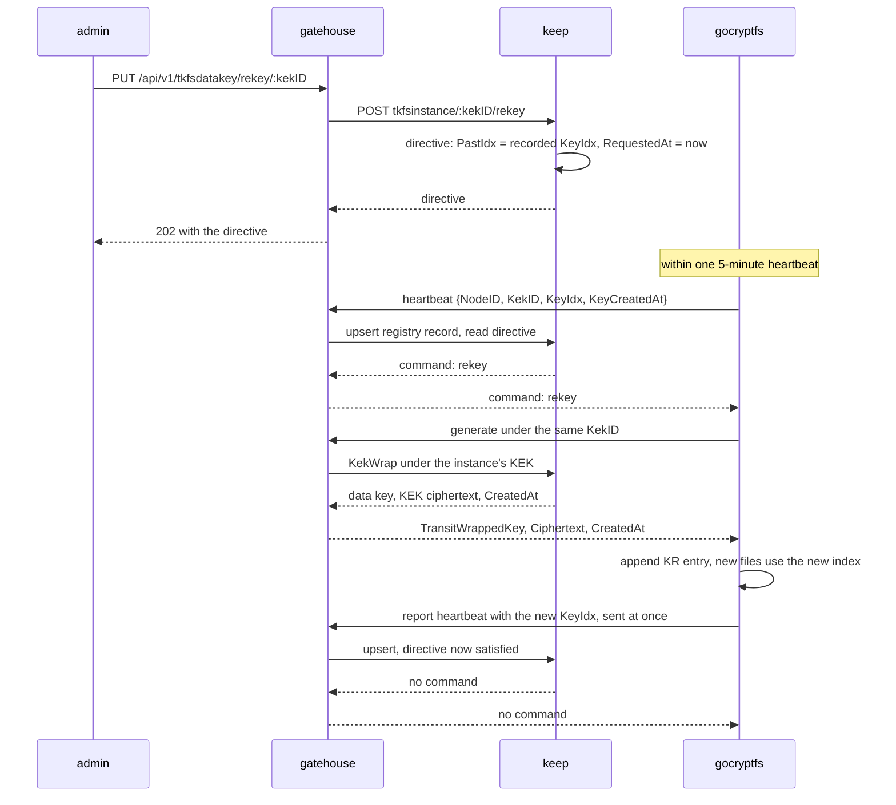
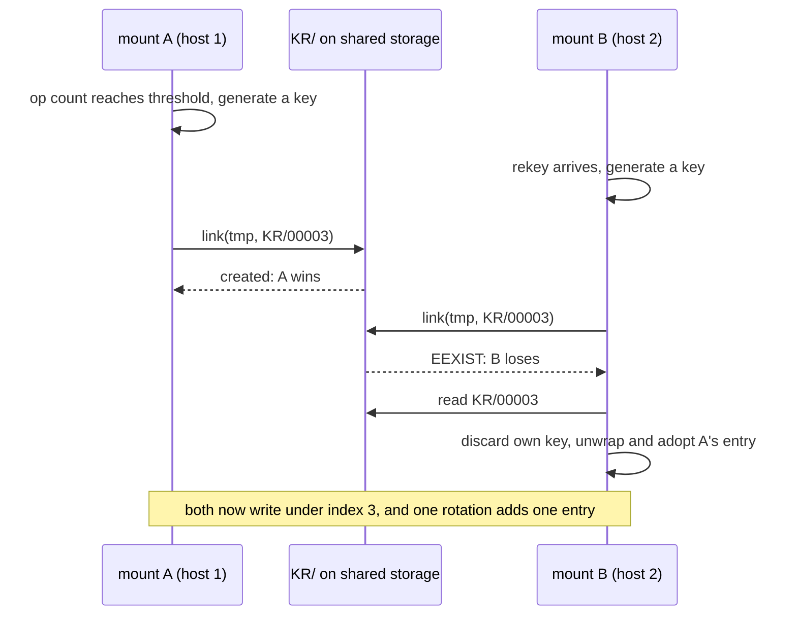
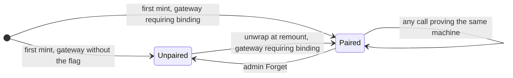

# TKFS v2 Review Guide

As of 2026-10-07. Living version: [TKFS v2 Review Guide](https://claude.ai/code/artifact/b55011d0-b567-41f6-bfcc-31332661db70).

TKFS v2 swaps TrustedBoundary for TrustedGateway and replaces per-file envelope keys with one KEK-wrapped data key per filesystem. On that base it adds key rotation, remote rekey, heartbeat revocation, optional EC2 instance binding and a gatehouse admin UI. Phases 0 to 5 are merged into each repo's `feature/tkfs-v2`; shared storage (Phase 3.5) is still in progress.

The work spans four repos: **gocryptfs** (the TKFS client), **gatehouse** (TrustedGateway), **keep** (TrustedKMS, which holds the KEKs and all TKFS state) and **tkutils** (shared model types).

| | TKFS v1 | TKFS v2 |
|---|---|---|
| Key service | TrustedBoundary | gatehouse data-key listener (mTLS, port 7083), backed by one KEK per instance in keep |
| Key model | A per-file key, wrapped under a TrustedBoundary envelope key and stored in the file's xattrs | One 32-byte data key per ring entry; HKDF derives the name key and the content key |
| Key at rest | `CEK` file and envelope xattrs | `KR` key ring holding only KEK ciphertext |
| On-disk format | v2 | v3 (hard break, migrate with `cp -a` through the plaintext view) |
| Concurrent mounts | Supported (`-sharedstorage`) | One mount per filesystem until Phase 3.5 lands |

New in v2:

- **Rotation**: new writes go to the newest key, old data stays readable under its own key.
- **Remote rekey**: an admin asks the gateway; the instance picks it up on its next heartbeat.
- **Revocation**: an ACL removal or a block takes effect at the next heartbeat and unmounts the filesystem.
- **Instance binding**: a gateway can require each instance to prove which EC2 machine it runs on.
- **Admin UI**: a TKFS page in gatehouse for instances, access control, trusted CAs and binding.

## Architecture

In v1 the client fetched envelope keys from TrustedBoundary by an ID stored in each file's xattrs, and unwrapped each file's key locally. In v2 the client talks only to a dedicated gatehouse listener, and keep makes the ACL and blocklist decisions.



Besides the mTLS check against the trusted CA set, gatehouse decides only instance binding, including refusing `-sharedstorage`, when `TKFSRequireBinding` is on. A `-search` mount (not drawn) calls keep directly on :7070 with a tenant token, skipping the gateway and the ACL; the blocklist still applies.

## Phases

Seven phases are merged, each as squash-merged PRs into the `feature/tkfs-v2` branch of every repo it touched (epic TK-1082). Phase 4 has two PRs per repo: the binding work and the InstanceID to KekID rename.

| Phase | Ticket | What landed | PRs: gocryptfs / tkutils / keep / gatehouse | Merged |
|---|---|---|---|---|
| 0 Contract and scaffolding | TK-1390 | Connector interface, in-process mock gateway, key-ring schema | #8 / - / - / - | 2026-07-20 |
| 1 Remove Boundary, gateway mTLS | TK-1391 | Boundary code deleted; mTLS client; dedicated gatehouse data-key listener; keep policy store and admin API | #9 / #76 / #239 / #354 | 2026-07-26 |
| 1.5 Transit wrap, key hygiene | TK-1416 | Data key wrapped to a per-call RSA-3072 key on the wire; key zeroized after use | #10 / #78 / - / - | 2026-07-27 |
| 2 KEK lifecycle | TK-1392 | Envelope model removed; one HKDF-derived key; `KR` ring; format v3; `-search` moved to KEK | #12 / #79 / #249 / #356 | 2026-08-05 |
| 3 Rotation and rekeying | TK-1393 | Multi-key ring, per-object key index, op-counter rotation, heartbeat, pulled rekey, blocklist, one KEK per instance | #16 / #82 / #310 / #403 | 2026-09-29 |
| 4 Instance binding | TK-1394 (rename: TK-1082) | EC2 identity proof, gateway-enforced binding, identity-cert routes; then the InstanceID to KekID rename | #17, #18 / #85, #86 / #311, #312 / #404, #405 | 2026-10-03 |
| 5 Admin UI | TK-1434 | gatehouse TKFS page; Forget deletes the binding; docker test kit | #19, #20 / #87 / #313 / #406 | 2026-10-05 |
| 3.5 Shared storage | TK-1720 | Multi-mount `-sharedstorage` through an append-only ring | In progress | - |
| 6 Chores | TK-1740 | Planned: post-quantum (ML-KEM) transit wrap, "block pending" instance status, stale gocryptfs test and doc pruning, review findings | - | - |
| 7 Integration testing | TK-1741 | Planned: automated fake-gateway and real-stack suites (blocks, rekey, binding, shared storage, `-search`, backwards compatibility), xfstests | - | - |
| 8 Migration, docs, hardening | TK-1395 | Planned | - | - |

## Key model

A filesystem's keys live in `KR`, a ring of entries that each hold one 32-byte data key as KEK ciphertext; keep holds the KEK, and the plaintext key exists only in mount memory. `gocryptfs.conf` carries no key material at all.

- **One key, two halves.** `cryptocore.New` HKDF-derives an EME name key and an AEAD content key from each entry, as stock gocryptfs does. The v1 envelope code (`tk_aead_*`, `CEK`, envelope xattrs) is gone.
- **The first mount generates, not `-init`.** `-init` writes the config and NodeID and never calls the key service. The first mount mints the key, writes the root `gocryptfs.diriv`, then persists the ring before anything uses the key.
- **No plaintext key between client and key service.** Each generate and unwrap mints an ephemeral RSA-3072 transport key, and the gateway (keep, on `-search`) returns the data key RSA-OAEP-wrapped to it as `TransitWrappedKey`. See [Transit wrap](#transit-wrap).
- **Identity comes from the key.** keep mints one KEK on an instance's first generate, and its id is the instance's `KekID`. Every ring entry repeats it as `KeyID`, so `KeyID` never distinguishes entries; `Ciphertext` does.
- **Hygiene.** Memory is locked, and each plaintext key is zeroized right after `cryptocore.New`.



A historical entry that fails to unwrap leaves a hole: files written under it return EIO and the mount carries on. Failing to unwrap the active entry, or index 0 when names are encrypted, fails the mount.

## Data-key service and authorization

A call succeeds when three things hold: its client CA is trusted, its DN is in the ACL, and nothing in the blocklist names it. Binding adds a fourth on gateways that require it.

- **Listener.** gatehouse serves `generate`, `unwrap` and `heartbeat` on a dedicated mTLS port, 7083 by default (`TKFSDataKeyPort`). Its client-CA pool is the operator's trusted CA set, not the tenant PKI. A supervisor starts the listener only while at least one CA exists, because an empty pool would fail open.
- **keep decides.** gatehouse forwards to keep, where `tcv.TKFSPermissionCheck` checks the ACL and blocklist on every call. TKFS calls use `ServiceTKFS`, which skips keep's MCSE collection check.
- **`-search` route.** TrustedSearch mounts call keep directly at `/keepsvc/tenantdatakey/*` on :7070 with a tenant token. keep skips the ACL there but applies the blocklist. The route is passed in by the handler, never read from the wire.
- **Hard and soft blocks.** The DN comes from the verified certificate, so a DN block is hard. A KekID block is hard for key access, because unwrap only works under the KEK that id names; it is soft only on heartbeats. NodeID is self-asserted, so a NodeID block only stops a cooperative instance.



If the gateway cannot make the binding check (identity certs not loaded yet, or the pairing read fails) or cannot save a new pairing, it answers 502, which the client counts as an outage rather than a refusal.

keep stores TKFS state per tenant in five objects:

| keep path | Type | Holds | Read by |
|---|---|---|---|
| `tkfsca` | `TKFSTrustedCAs` | Client CA set | Every gateway, for the listener's trust pool |
| `tkfs` | `TKFSPolicy` | ACL (a set of DNs), blocklist, identity certs | keep on every call; gateways fetch only the identity certs |
| `tkfsi/<kekID>` | `TKFSInstance` | Registry record: DN, NodeID, key index, last seen, verified host, route | Rewritten by each heartbeat; read by a rekey request for `PastIdx`; shown in the admin UI |
| `tkfsr/<kekID>` | `TKFSRekeyDirective` | Pending rekey: `PastIdx`, `RequestedAt` | Each heartbeat |
| `tkfsb/<kekID>` | `TKFSBinding` | The machine an instance is paired with | Gateways requiring binding |

The CA set is kept apart from the policy so that a policy which fails to decode cannot tear down the listener. It still fails every heartbeat in the tenant as an outage (keep 500, gateway 502), because keep reads the policy on each one, so every mount drops after three beats; no admin route can rewrite an undecodable policy.

## Transit wrap

The data key never appears in a request or response body between gocryptfs and its key service: each generate and unwrap returns it encrypted to a throwaway RSA-3072 key the client made for that one call. This protects against passive exposure of the decrypted traffic, not against an attacker who can rewrite it.



- **Code.** Both sides use tkutils `model/transit.go`: `NewTransportKey`, `TransitWrap`, `TransitUnwrap`. The client wrappers are `newTransport` and `unwrapTransit` in gocryptfs `internal/tkc/gwconnect.go`.
- **Who wraps.** On the gateway route gatehouse wraps, after keep returns the plaintext over OEC, so the keep-to-gatehouse hop is outside this layer. On the `-search` route keep wraps itself.
- **What it stops.** Request or response logging, a TLS key log, or a dump of TLS buffers yields nothing usable.
- **What it does not stop.** Anyone who can modify the decrypted request can swap in their own `TransportPubKey`, read the key, re-wrap it to the client's key and forward the reply. On an mTLS channel that needs a broken TLS layer, and anyone holding an allowed certificate can already unwrap a copied `KR` directly, unless the gateway requires binding.
- **RSA only, by design.** A KEM cannot encrypt a chosen key, so a post-quantum transport would be a protocol change. `TransportAlg` already travels on the wire for that.
- **Testing.** `-mock-kms` has no wire and never wraps. The httptest fake gateway in `internal/tkc/gwconnect_test.go` exercises this path, including a check that the plaintext never appears on the wire.

## Rotation, rekey and heartbeat

Rotation appends a new data key to `KR` under the same KEK. New files, directories, symlinks and xattr values use it; an existing file keeps writing under the key in its header. Nothing is re-encrypted, and old data stays readable under the key that wrote it. A ring index is the entry's position in `KR`, so the ring is append-only.

Every encrypted object names its key index explicitly. There is no trial decryption, and a missing index is an error, never a default of 0.

| Object | Key half | Where the index lives |
|---|---|---|
| File content | content | `KeyIdx` in the 20-byte file header |
| Symlink target | content | Cleartext 2-byte prefix ahead of the ciphertext |
| Xattr value | content | Cleartext 2-byte prefix ahead of the ciphertext |
| Filename | name (EME) | The directory's `gocryptfs.diriv`, now 18 bytes |
| Xattr name | name (EME) | Per-inode marker xattr `user.gocryptfs_keyidx.<n>` |
| Long-name `.name` file | name (EME) | Inherits its directory's index |

Three things trigger a rotation:

1. **Op counter.** After 2^30 encrypt operations on the active key (about 4.4 TB at 4 KiB blocks). The count is persisted in `KR`, so it spans mounts. Set with `-rotate-op-threshold`; only `-ro` disables it.
2. **`-ctlsock`.** `{"Rotate": true}` returns the new `KeyIdx`; `{"Status": true}` returns the indices this mount could not unwrap.
3. **Remote rekey.** An admin asks the gateway, and the instance pulls the request on its next heartbeat. Nothing dials the instance.



A directive is satisfied once the instance reports an index past `PastIdx` and a key keep created after `RequestedAt`. Every timestamp in that rule is keep's, so the TKFS host's clock decides nothing (`KeyCreatedAt` is keep's stamp, relayed by the instance).

The heartbeat runs every 5 minutes and is not configurable, because it sets the revocation window. The first one goes out before the FUSE mount, so a refusal fails the mount with no mountpoint attached.

| Heartbeat answer | Effect |
|---|---|
| 200 | Reset the failure count; run a `rekey` if one came back |
| 403 | Unmount now (exit 33): authorization is gone |
| 409 | Unmount now (exit 35): a gateway requiring binding refused `-sharedstorage` |
| 404 or 501 | Unmount now (exit 33): a key service without the route cannot revoke |
| Anything else: transport or TLS failure, 401, other 4xx or 5xx | Count it; the third in a row unmounts (exit 33) |

Unmounting is not abortable: a clean unmount, a 10-second grace for a busy mountpoint, one retry, then exit. An outage spanning three heartbeats (possible after 10 minutes, certain after 15) therefore unmounts every filesystem in the tenant that uses the failed service: a gateway outage takes down gateway mounts, a keep outage takes down all of them.

| Exit code | Meaning |
|---|---|
| 31 | The health-check port could not be bound |
| 32 | The filesystem is already mounted by another process |
| 33 | Authorization withdrawn, or the heartbeat could not be answered |
| 34 | The op count could not be persisted, or an op-counter or rekey rotation failed other than by a refusal |
| 35 | A gateway requiring binding refused a `-sharedstorage` mount |

systemd units should set `RestartPreventExitStatus=33 35`.

Rotation is forward-only. A file keeps its content key and a directory its name key, so the root directory's names never rotate. Rotation also does not contain a KEK compromise, since one KEK wraps every entry; the answer to that is a new instance.

## Shared storage (in progress)

Phase 3.5 (TK-1720) brings back `-sharedstorage`: several mounts of one cipherdir, on one host or across hosts over NFSv4.1+ or EFS. Nothing is committed yet: parts 1 and 2 are built and part 3 (per-mount registry records) is in progress, in the phase worktrees of all four repos. Until it lands, a second mount on the same host exits 32.

The idea is to make key state write-once again, as it was in v1. `KR` becomes a directory, and each ring index is claimed with `link(2)`, which the backing filesystem arbitrates, so no lock guards key material.

| Path under `KR/` | Holds | Written by |
|---|---|---|
| `NNNNN` | One ring entry `{KeyID, Ciphertext, CreatedAt}` | Published once by `link(2)`, never rewritten |
| `ops/NNNNN.<mountID>` | One mount's op count under index NNNNN | Only that mount |
| `format` | Format-defining config fields | Published once by the first mount |
| `xattr.lock` | Byte-range lock target for xattr markers | Nobody; it is only locked |
| `nodes/…` | One lock file per NodeID; a second live mount with the same NodeID exits 32 | Its first holder; never removed |
| `.tmp.<mountID>.<seq>` | Staging for every publish | Its mount; garbage-collected after an hour |



- **Learning.** Each mount re-reads `KR/` every 10 seconds and whenever it meets an index it does not hold, then unwraps and installs the new entries.
- **Op counts.** Each mount writes its own shard, and the head key's shards are summed against the threshold.
- **Guards.** A storage gate (Linux only) admits local filesystems and NFS 4.1 or later mounted `hard`, with `local_lock=none` and without `nolock` or `nocto`; it refuses NFSv3 and 4.0, SMB, FUSE and anything it does not recognize. `KR/format` refuses a mount whose config disagrees with the first one.
- **Not covered.** Concurrent writes to the same file, and `-fsck`. Binding is also out of scope: a gateway requiring binding refuses `-sharedstorage` with exit 35.

## Instance binding

A gateway that requires binding pairs each instance with the first EC2 machine to mint or unwrap through it, then refuses calls from any other machine. A stolen client certificate plus a copied cipherdir therefore stops working elsewhere.

- **Proof.** EC2's IMDS `rsa2048` signature: PKCS#7, RSA-2048 over SHA-256, which verifies under `fips140=only`. The client fetches it once per mount and sends it on generate, unwrap and heartbeat.
- **Verification.** gatehouse verifies offline against identity certs an admin uploads, one per AWS region. None are built in, and a cert embedded in the proof is never trusted.
- **The switch.** gatehouse startup config `UserData.TKFSRequireBinding` (docker: `TKFS_REQUIRE_BINDING`), off by default. It is per gateway, so a mixed fleet enforces only where it is set.
- **The machine.** Account ID, region and EC2 instance ID. Image ID and private IP are shown to admins but not matched.
- **The pairing.** Stored in keep at `tkfsb/<kekID>`, written only after keep authorizes the call. It never moves; an admin Forget deletes it with the instance record.



Behind a gateway requiring binding, an unpaired instance's heartbeat or rotation is refused, so mounts already running when the flag goes on exit 33 and pair at their remount. A call proving another machine, or none, gets 403 and exit 33 (or 502, counted as an outage, while the gateway has not yet loaded its identity certs).

What it does not close: anything that can read IMDS on the paired machine can replay its proof, since the signed document is static. Pairing is trust on first use, and Forget reopens it. `-search` mounts send no proof and are never paired. `-mock-aws` proves a fake machine for dev stacks.

## Admin UI

gatehouse's cobblestone UI gains a TKFS page with four tabs, in `cobblestone/src/app/tkfs/`. Every action calls a `RequireAdmin` route under `/api/v1/tkfsdatakey/`, which gatehouse proxies to keep.

| Tab | Shows | Actions |
|---|---|---|
| Instances | One row per instance, from heartbeats or a pairing. Status: Active, Blocked, Refused (the UI's prediction under binding), Unreachable or No record. A Host column when keep supports binding, and a Binding column (Bound, Host mismatch, Unverified, Search mount) when this node requires it | Rekey (rows with a record), Block, Forget |
| Access Control | Allowed DNs and the blocklist | Add or remove a DN; add or remove a block on DN, NodeID or KekID |
| Trusted CAs | The listener's client CA set; a warning when it is empty | Upload a PEM cert or chain; remove by fingerprint |
| Instance Binding | Whether this gateway node requires binding (read-only) and the identity certs | Add or remove an identity cert |

The Instance Binding tab is hidden when keep is too old to support binding or the policy cannot be read. Forget deletes the instance record, any pending rekey and the pairing; a mount that is still running registers again on its next heartbeat, or exits 33 behind a gateway requiring binding.

## Security model and known limits

The KEK model makes a stolen cipherdir useless without the key service and gives revocation a bounded window. It does not protect a compromised machine that is authorized and running: the key is in its memory, and its certificate can replay generate and unwrap.

| Limit | Detail | What narrows it |
|---|---|---|
| `KR` is a bearer capability within a tenant | Unwrap selects the KEK by the `KeyID` in `KR` and checks only that the caller's DN is allowed and not blocked (only the blocklist, on `-search`), so any authorized client holding another filesystem's `KR` can unwrap it | Binding, for paired instances behind a gateway that requires it; separate tenants |
| NodeID is self-asserted | A NodeID block is soft. DN and KekID blocks refuse key release, but no block stops a running mount that ignores the refusal | Block the DN or KekID, remove the DN from the ACL, or remove its CA |
| Outage unmounts the fleet | An outage spanning three heartbeats (10 to 15 minutes) unmounts every mount that uses the failed service: gateway mounts for a gateway outage, all of them for keep. So does a stored policy that fails to decode, and no admin route can repair one | Accepted trade for bounded revocation |
| Removing the last trusted CA | The listener shuts down and every gateway mount in the tenant unmounts within the heartbeat window | The UI warns and asks to confirm before removing the last CA |
| Transit wrap is passive-only | The transport key is not bound to the mTLS identity, so an active middlebox that rewrites bodies is out of scope | TLS to the gateway |
| Rotation is forward-only | Existing files and directories keep their keys; a KEK compromise is not contained by rotation | New instance and copy the data |
| Binding is trust on first use | Anything that can read IMDS on the paired machine can replay its static proof; Forget reopens pairing | IMDSv2 required (`HttpTokens=required`) with hop limit 1 |
| `-mock-kms` | No heartbeat, so no revocation or rekey; tests on it cannot catch those regressions | The docker test stack |

Open decision: soft isolation below the certificate boundary was accepted on 2026-07-29 for now (the boundary was then the DN; since Phase 3 it is the tenant), to be reassessed when the epic closes. A hard per-filesystem boundary would need an authenticated per-filesystem identity, such as a certificate per filesystem.

## Review map

Start in gocryptfs `mount.go` and follow the key from `KR` to the cipher cores; the server side is thin handlers around keep's KEK operations. In gocryptfs, non-test Go code is +2,727 / -1,487 lines against `tkfs` (`fdb3bd4`), which the branch merged on 2026-10-07; tests add about 4,100.

| Repo | Where to look | What to check |
|---|---|---|
| gocryptfs | `mount.go`: `doMount`, `initFuseFrontend`, `generateInitialDataKey`, `buildKeySets`, `keyServiceExit` | Order on first mount (diriv, then ring, then heartbeat, then FUSE); which unwrap failures are fatal |
| gocryptfs | `heartbeat.go` (`keyServiceMonitor`), `rotate.go` (`keyRotator`) | Three-strike and immediate-death rules; rotation succeeds or ends the mount |
| gocryptfs | `internal/configfile/keyring.go`, `config_file.go`, `validate.go` | Append-only ring; every entry shares one KeyID; empty ring only before the first mount |
| gocryptfs | `internal/contentenc/`, `internal/nametransform/diriv.go`, `names.go`, `internal/fusefrontend/node_xattr.go`, `root_node.go` | Explicit key index on every object; no default of 0; 18-byte diriv; xattr marker |
| gocryptfs | `internal/tkc/`: `gateway.go`, `gwconnect.go`, `search_connect.go`, `machine.go`, `mock_gwconnect.go` | Transit unwrap, error mapping to `ErrDenied`, identity proof fetch |
| tkutils | `model/`: `tkfsdatakey.go`, `transit.go`, `tkfspolicy.go`, `tkfsidentity.go`; `awsidentity/` | Wire types; RSA-OAEP transit; blocklist matching; PKCS#7 verify and its 8 KiB cap |
| keep | `tcv/tkfs.go`, `tcv/object_keywrap.go`, `tenants/tenant_mgr_tkfs*.go`, `tenant_mgr_keywrap.go` (`ensureKek`), `tenant_mgr_paths.go` | The single `TKFSPermissionCheck`; one KEK per instance resolved by id, never through `kek/curr` |
| keep | `web/tkfspolicy.go`, `tkfscas.go`, `tkfsinstance.go`, `tkfsbinding.go`, `tenantdatakey.go` | Admin routes; heartbeat upsert and rekey directive; `-search` route keeps the blocklist |
| gatehouse | `management/tkfsdatakey.go`, `tkfsbinding.go`, `tkfsrekey.go`, `tkfsdatakey_admin.go`, `ctx/tkfscas.go`, `ctx/tkfsidentitycerts.go` | Listener supervisor; binding check order; key zeroized on every error path |
| gatehouse | `cobblestone/src/app/tkfs/` | The four admin tabs |

To try it end to end, gocryptfs `docker/` holds a test kit that mounts TKFS against the gatehouse docker stack, with binding switched by `TKFS_REQUIRE_BINDING`.

## Running the stack

The gatehouse docker stack runs the gateway, keep and the admin UI; gocryptfs `docker/` runs TKFS mounts in containers on its network. The full reference is [docker/README.md](../docker/README.md).

You need Docker with buildx, FUSE on the host (`/dev/fuse`), openssl, jq, the aws CLI for the ECR login described in gatehouse `docker/README.md`, and an SSH agent or `GH_TOKEN` for the private TrustedKeep modules. Check out gatehouse, keep and gocryptfs on `feature/tkfs-v2`.

1. Build the server images, each tagged `:local_dev`:

    ```
    cd gatehouse/docker && ./build_images.sh
    cd keep/docker && ./build_images.sh
    ```

2. Start the stack, in gatehouse `docker/`. This `up` recreates keep and loses every KEK, so use it only for a fresh start.

    ```
    ./certs.sh        # once a year
    docker compose up -V --force-recreate --remove-orphans -d --wait
    ```

3. Make the TKFS certs, in gocryptfs `docker/`. Set `STACK_CERTS` if the stack runs from a checkout outside your GOPATH.

    ```
    ./certs.sh
    ```

4. Trust the TKFS CA and allow a DN. In the UI at https://localhost:7071 (certificate `local_dev_admin1`), open **TKFS**, add `docker/certs/tkfs_ca.crt` under **Trusted CAs**, and allow `CN=tkfs_host1,O=TK-DEV` under **Access Control**. Or use the stunnel port, which presents admin1 for you:

    ```
    curl -XPOST --data-binary @certs/tkfs_ca.crt http://localhost:13271/api/v1/tkfsdatakey/ca
    curl -XPUT 'http://localhost:13271/api/v1/tkfsdatakey/acl/CN=tkfs_host1,O=TK-DEV'
    ```

    The data-key listener starts within about a minute of the first CA being added.

5. Mount, each in its own terminal. Ctrl-C unmounts.

    ```
    ./mount.sh a                  # as tkfs_host1
    ./mount.sh b tkfs_host2       # a second instance
    docker exec -it tkfs-a sh     # files are under /tkfs/state/a/mnt
    ```

6. Optional binding. Add `docker/certs/aws_mock_identity.crt` under **Instance Binding**, then recreate the gateway with binding on, in gatehouse `docker/`:

    ```
    TKFS_REQUIRE_BINDING=true docker compose up -d --force-recreate --no-deps --wait gateway
    ```

After a code change:

- **gocryptfs:** remount; `mount.sh` rebuilds the image.
- **gatehouse or UI:** run `./build_images.sh`, then `docker compose up -d --force-recreate --no-deps --wait gateway`. keep and its KEKs survive. Pass `TKFS_REQUIRE_BINDING=true` again if binding was on.
- **keep:** recreating `kms` loses every KEK, the same as a teardown.

To pause, run `docker compose stop` and later `docker compose up -d --wait` in gatehouse `docker/`; prefix the `up` with `TKFS_REQUIRE_BINDING=true` if binding was on, or the gateway comes back with it off. To tear everything down, stop every mount (`docker ps -q --filter name=tkfs- | xargs -r docker stop`), then run `docker compose down -v` in gocryptfs `docker/` and again in gatehouse `docker/`. That deletes every KEK, so the old filesystems can never be mounted again.

[docker/TESTING.md](../docker/TESTING.md) lists the ten manual checks from TK-1434 and TK-1394: no CA, CA added, DN not allowed, DN allowed, untrusted CA, rekey, block, revoke, unreachable, and binding.

## Automated tests

All four repos test with plain `go test`. gocryptfs needs FUSE and a fresh binary, and keep and gatehouse need their UI assets generated first.

| Repo | Setup | Run | Notes |
|---|---|---|---|
| gocryptfs | `go build -o gocryptfs .` | `go test ./...`, or `./test.bash` for build, vet and tests together | Tests under `tests/` run `../../gocryptfs`, so a stale binary gives false results. TKFS integration tests are in `tests/tkfs_kek/` (20, on `-mock-kms`); heartbeat and rotation unit tests are in the root package |
| tkutils | none | `go test ./model/... ./awsidentity/...` | FIPS check: `GOFIPS140=v1.0.0 GODEBUG=fips140=only go test ./awsidentity/` |
| keep | `go generate ./...` (needs `go-bindata` and `npm`); cgo on | `go test ./tcv/ ./tenants/ ./web/` | |
| gatehouse | `go generate ./cobblestone` | `go test ./management/ ./ctx/` | |
| gatehouse UI | Node 22, `CHROME_BIN` set | in `cobblestone/`: `npm ci && npm run lint && npm run test:ci && npm run build:prod` | |

Known gocryptfs failures that are not TKFS: `tests/matrix` `TestUtimesNano`, and `TestForceOwner`, `TestDirectMount` and `tests/root_test` unless `/etc/fuse.conf` has `user_allow_other`.

## Sources

The phase design docs were removed from `feature/tkfs-v2` on 2026-10-06; these links go to `b80a94f`, the last commit that has them:

- [Phase 1.5: transit wrap and key hygiene](https://github.com/TrustedKeep/gocryptfs/blob/b80a94f/Documentation/phase-1.5-transit-wrap-and-key-hygiene.md)
- [Phase 2: KEK lifecycle](https://github.com/TrustedKeep/gocryptfs/blob/b80a94f/Documentation/phase-2-kek-lifecycle.md)
- [Phase 3: rotation and rekeying](https://github.com/TrustedKeep/gocryptfs/blob/b80a94f/Documentation/phase-3-rotation-rekeying.md)
- [Phase 4: instance binding](https://github.com/TrustedKeep/gocryptfs/blob/b80a94f/Documentation/phase-4-instance-binding.md)
- [MANPAGE.md](MANPAGE.md): heartbeat, binding and exit codes
- [file-format.md](file-format.md): on-disk format v3
- [Shared storage explainer](https://claude.ai/artifact/R565Bc81rv3nSuKTYiD6wg): Phase 3.5 diagrams

| Repo | Merged PRs into `feature/tkfs-v2` |
|---|---|
| gocryptfs | [#8](https://github.com/TrustedKeep/gocryptfs/pull/8), [#9](https://github.com/TrustedKeep/gocryptfs/pull/9), [#10](https://github.com/TrustedKeep/gocryptfs/pull/10), [#12](https://github.com/TrustedKeep/gocryptfs/pull/12), [#16](https://github.com/TrustedKeep/gocryptfs/pull/16), [#17](https://github.com/TrustedKeep/gocryptfs/pull/17), [#18](https://github.com/TrustedKeep/gocryptfs/pull/18), [#19](https://github.com/TrustedKeep/gocryptfs/pull/19), [#20](https://github.com/TrustedKeep/gocryptfs/pull/20) |
| tkutils | [#76](https://github.com/TrustedKeep/tkutils/pull/76), [#78](https://github.com/TrustedKeep/tkutils/pull/78), [#79](https://github.com/TrustedKeep/tkutils/pull/79), [#82](https://github.com/TrustedKeep/tkutils/pull/82), [#85](https://github.com/TrustedKeep/tkutils/pull/85), [#86](https://github.com/TrustedKeep/tkutils/pull/86), [#87](https://github.com/TrustedKeep/tkutils/pull/87) |
| keep | [#239](https://github.com/TrustedKeep/keep/pull/239), [#249](https://github.com/TrustedKeep/keep/pull/249), [#310](https://github.com/TrustedKeep/keep/pull/310), [#311](https://github.com/TrustedKeep/keep/pull/311), [#312](https://github.com/TrustedKeep/keep/pull/312), [#313](https://github.com/TrustedKeep/keep/pull/313) |
| gatehouse | [#354](https://github.com/TrustedKeep/gatehouse/pull/354), [#356](https://github.com/TrustedKeep/gatehouse/pull/356), [#403](https://github.com/TrustedKeep/gatehouse/pull/403), [#404](https://github.com/TrustedKeep/gatehouse/pull/404), [#405](https://github.com/TrustedKeep/gatehouse/pull/405), [#406](https://github.com/TrustedKeep/gatehouse/pull/406) |
